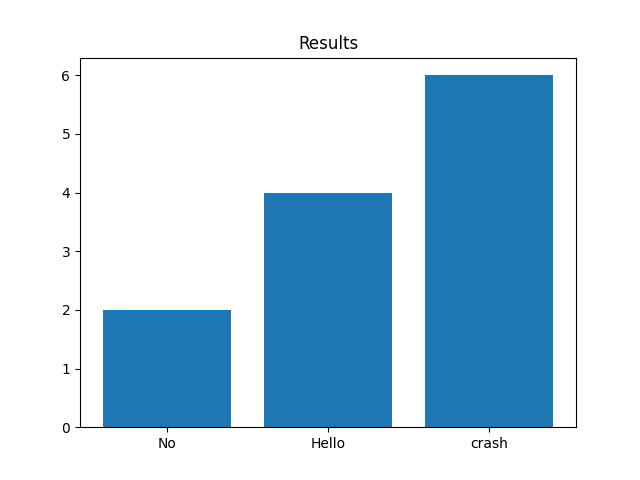

## If Assignment Little Research

### In this research I've decided to find the percentage of the languages that support this syntax and the languages that shows erros when you use it.

> Sudo code (Example)

```
x = 5
if (x = 10) -> print("Hello")
else -> print("No")

# The output of this code can be Hello, No or a crash. (depending on the programming language)
```

### Final results sneak peek



### I'll go over 11 new languages and show if they support this syntax or forbidd it.

#### Language List:

    - bash
    - c++
    - c#
    - dart
    - go
    - java
    - javascript
    - kotlin
    - python
    - ruby
    - typescipt

<hr>

### Bash

- code used to test:

```sh
x=5

if [ x = 10 ]; then
    echo "Hello";
else
    echo "No";
fi
```

#### The output of this code was "No", this means that the value of the condition x = 10 for bash was falsy

<hr>

### C++

- code used to test:

```cpp
#include <iostream>

int main(int argc, const char * argv[])
{
	int x = 5;

    if ( x = 10 ) {
        std::cout << "Hello" << std::endl;
    } else {
        std::cout << "No" << std::endl;
    }

    return 0;
}
```

#### The output of this code was "Hello", this means that the value of the condition x = 10 for bash was truthy

<hr>

### C#

- code used to test:

```cs
int x = 5;

if ( x = 10 ) {
    Console.WriteLine("Hello");
} else {
    Console.WriteLine("No");
}
```

#### The this code crashed, so this means that the c# doesn't support this syntax

<hr>

### Dart

- code used to test:

```dart
void main() {
  int x = 5;
  // Error, wrong syntax
  if ( x = 10 ) {
    print("Hello");
  } else {
    print("No");
  }
}
```

#### The this code crashed, so this means that dart doesn't support this syntax

<hr>

### Go

- code used to test:

```go
package main

import "fmt"

func main() {
   var x int = 5;

   if ( x = 10 ) {
	fmt.Println("Hello");
   } else {
	fmt.Println("No");
   }
}
```

#### The this code crashed, so this means that go doesn't support this syntax

<hr>

### Java

- code used to test:

```java
public class App {
    public static void main(String[] args) {
        int x = 5;

        if ( x = 10 ) {
            System.out.printf("Hello");
        } else {
            System.out.printf("No");
        }
    }
}
```

#### The this code crashed, so this means that java doesn't support this syntax

<hr>

### JavaScript

- code used to test:

```js
let x = 5;

if ((x = 10)) {
  console.log("Hello");
} else {
  console.log("No");
}
```

#### The output of this code was "Hello", that means that javascript supports this syntax.

<hr>

### Kotlin

- code used to test:

```kt
fun main() {
    val a: Int = 5
    if (a = 10) {
        println("Hello")
    } else {
        println("No")
    }
}
```

#### The this code crashed, so this means that kotlin is like java doesn't support this syntax

<hr>

### Python

- code used to test:

```py
x: int  = 5

# This code crashes
if x = 10:
    print ("Hello")
else:
    print("No")
```

#### The this code crashed, so this means that python doesn't support this syntax but it features a different syntax for the same use

```py
if x := 10:
    print ("Hello")
else:
    print("No")
```

<br>

### Ruby

- code used to test:

```rb
x = 5

if ( x = 10 )
    puts "Hello"
else
    puts "No"
end
```

#### The this code crashed, so this means that ruby doesn't support this syntax

<hr>

### Typescript

- code used to test:

```ts
const app = () => {
  let x: number = 5;

  if ((x = 10)) {
    console.log("Hello");
  } else {
    console.log("No");
  }
};

app();
```

#### The result of this test should be ovious because we already have the output "Hello" from javascript.

<hr>

### Thx for reading
